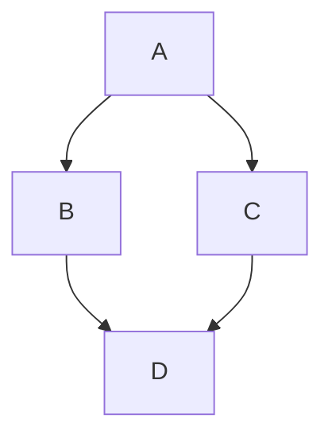

# 26_1-Joao-Victor-Machado-Rangel
**Título do TCC: DETECÇÃO DE MISOGINIA EM MENSAGENS TEXTUAIS**
**Alunos: João Victor Machado Rangel** <!-- substitua pelos nomes dos alunos -->
**Semestre de Defesa: 2026-1** <!-- ano-semestre, exemplo: 2025-2 -->

[PDF do TCC](caminho_do_arquivo)


# TL;DR

<!-- Resumo super conciso para quem não quer ler o README e começar a executar o código -->
Para rodar:
```$ pm2 start ecosystem.config.js```


# Descrição Geral
Este estudo investiga a disseminação da misoginia nas redes sociais brasileiras e propõe
uma abordagem fundamentada em recuperação lexical e validação humana para apoiar a
sua detecção automatizada. O trabalho apresenta o desenvolvimento do LexMis-BR, um
léxico expandido construído de forma colaborativa para superar a escassez de recursos
linguísticos específicos para o português do Brasil. A metodologia, aprovada pelo Comitê
de Ética em Pesquisa , integrou a coleta de mensagens no X com a rotulação realizada por
voluntários, buscando produzir recursos alinhados ao contexto sociolinguístico nacional.
A etapa de rotulação evidenciou que, embora a recuperação lexical seja útil para orientar a
construção do corpus, ela se mostra insuficiente como critério de decisão final devido à ambiguidade
inerente aos enunciados, o que reforça a necessidade do julgamento contextual
humano na consolidação de dados confiáveis. Foram avaliados modelos supervisionados
de classificação, e os resultados indicam que os recursos produzidos são relevantes para
o avanço do estudo computacional da misoginia, oferecendo uma base empírica para o
aprimoramento de sistemas de moderação de conteúdo no cenário brasileiro.


# Funcionalidades
<!-- Descreva as principais funcionalidades do seu código. Exemplo: -->
* Funcionalidade principal 1
   * detalhe a
   * detalhe b
   * detalhe c
* Funcionalidade principal 2
   * detalhe d
   * detalhe e


# Arquitetura
<!-- Descreva nessa seção a arquitetura do seu código. Sugestão use mermaid para inclusão de diagramas que ajudem a entender seu código (https://docs.github.com/en/get-started/writing-on-github/working-with-advanced-formatting/creating-diagrams) -->



# Dependências

<!-- Apresente a lista de dependências do seu código. Quando necessário, incluia links. Exemplo: -->
* Mosquitto MQTT Broker
* Node JS
* [PM2](https://pm2.keymetrics.io)
* [NW.js](https://nwjs.io)
* [FFmpeg](https://ffmpeg.org)


# Execução

<!-- Descreva como instalar/executar seu código. Exemplo: -->
Componentes executados com PM2.
```$ pm2 start ecosystem.config.js```
 
